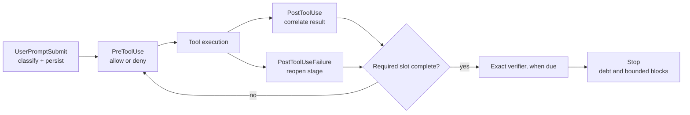

# grok-build

Grok Build is an unofficial cooperative routing and stage-gating layer for the Grok CLI. It classifies prompts, selects configured roles, tracks execution stages, and gates the consenting conductor until required work is complete. It is not affiliated with or endorsed by xAI. Grok Build is MIT licensed.

## How it works

The hook observes the Grok CLI hook contract and keeps routing deterministic:

1. `UserPromptSubmit` passively classifies the prompt and persists the decision; it does not print a route intended to switch the open session model.
2. `PreToolUse` makes the single terminal allow/deny decision. It gates the next spawn, applies the reconnaissance diet, permits only the exact configured verifier when that verifier is due, and permanently denies conductor writes, including edit-capable tools and write shell commands.
3. `PostToolUse` correlates successful child results, background task IDs, and verifier results with their stage or barrier member.
4. `PostToolUseFailure` records failed tool or child execution and reopens the associated stage.
5. `Stop` records and blocks unfinished execution debt, bounded by the configured stop limit and debt window.

The deterministic pipeline is `extract → features → classify → policy → roles → compose → gate → record`. Execution stages are `spawn` for one child, `parallel_spawn` for a keyed barrier, `verify` for an exact non-spawnable command, and `sentinel` for an explicit unavailable or observe-only condition. Stages consume linear slots, barrier member slots, verifier slots (`verify/0` through `verify/N`), or sentinel slots; each outstanding slot is tracked independently.



Modes are `static` (classify only), `shadow` (classify and persist without stage denials), and `dynamic` (classify, persist, and enforce stage gates). The permanent conductor zero-write deny for edit-capable tools and write shell commands applies in every mode; this is the zero-write-in-every-mode exception to the mode table. See [`grokbuild/README.md`](grokbuild/README.md) and [`docs/grok-build.md`](docs/grok-build.md) for the normative details and runbooks.

## Quickstart

Requirements are POSIX with `fcntl`, Python 3.11 or newer, and the Grok CLI.

```bash
./scripts/install.sh
```

The installer is idempotent. It symlinks repository files into `~/.grok` for agents, skills, rules, hooks, and routing, and links or merges `config.toml` with a backup. It does not provision, modify, or print credentials. When `~/.grok/config.toml` is an account-owned regular file, it reads it, creates a backup, and merges managed tables while preserving unmanaged settings, which may include embedded credential values. It does not provision `~/.env_keys`. Re-running the installer synchronizes missing repository model and role blocks into an account-owned live config while preserving existing live pins.

```bash
grok-route roles
printf '{}' | ~/.grok/hooks/route.py
./tests/grok-route-test.sh
```

## Requirements & subscription tiers

The provider-role matrix below is derived from [`grokbuild/providers.json`](grokbuild/providers.json) and [`grokbuild/roles_default.json`](grokbuild/roles_default.json); credential names and provider tier annotations are shown in [`grokbuild/providers.json`](grokbuild/providers.json) and, where configured, [`config/config.example.toml`](config/config.example.toml).

| Provider | Class | Credential | Roles pinned to the provider |
| --- | --- | --- | --- |
| `commandcode` | reserve | `COMMANDCODE_API_KEY` | `plan-comparator`, `judge-primary` |
| `minimax` | primary | `MINIMAX_API_KEY` | `explore-risk`, `visual-intake` |
| `opencode` | reserve | `OPENCODE_GO_API_KEY` | `implement-overflow`, `implement-cheap-fallback`, `expert-rescue`, `consilium-challenger`, `planner-a` |
| `codex` | primary | `~/.codex/auth.json` | `explore`, `explore-thorough`, `plan`, `plan-hard`, `implement`, `implement-cheap`, `implement-standard`, `implement-strong`, `implement-hard`, `planner-strong`, `review`, `consilium-arbiter`, `visual-intake-deep`, `researcher`, `planner-c`, `judge-disagreement`, `judge-frontier-general`, `frontier-resolver-standby` |
| `zai` | primary | `ZAI_API_KEY` | `implement-ops`, `review-hard`, `consilium-analyst`, `security`, `researcher-analyst`, `planner-b`, `criterion-judge`, `judge-independent`, `verifier-planner` |
| `xai` | primary | `~/.grok/auth.json plus an availability signal` | `review-independent`, `security-verify`, `researcher-challenger`, `judge-frontier-code`, `frontier-resolver` |
| `together` | primary | `TOGETHER_API_KEY` | `judge-challenger-agentic`, `judge-challenger-structural` |

Together binds both opt-in challengers to `openai/gpt-oss-120b`; the retained `openai/gpt-oss-20b` catalog entry is an unbound economy alternative. The `gpt-oss-120b` choice follows AgentJudgeBench tool-selection alignment (88.7% versus 70.7% for 20B), with negligible cost delta at challenger rarity. The retained `Qwen/QwQ-32B` catalog entry is dedicated-endpoint-only because its serverless service was retired by the vendor.

`subscription_class` is a preference classification used for reporting and model-endpoint selection; current routing uses the `@commandcode` second endpoints: `qwen3.8-max` and `kimi-k3` balance=rotate across OpenCode Go and Command Code, while `deepseek-v4-pro`, `deepseek-v4-flash`, `minimax-m3`, and `glm-5.3-flash` use Command Code as an ordered reserve. A model whose catalog entry declares `balance = "rotate"` spreads sessions across its endpoints, so those endpoints must belong to providers of the same class (peer pools, as `opencode` and `commandcode` both are); its endpoint-level `primary`/`reserve` labels then record declaration order rather than priority. Under `balance = "ordered"` the declared primary is tried first and a later endpoint may not belong to a higher class than an earlier one. `tests/test_subscription_class.py` enforces both rules. It is orthogonal to Minimum, Recommended, and Full, which describe availability. The `minimax` / `minimax-m3` pair is the primary visual-provider sample; the configured model-level endpoint pairs are described above. This provider-level metadata is declarative and used for reporting only.

The derived levels are:

- **Minimum — Codex subscription:** `explore`, `explore-thorough`, `plan`, `plan-hard`, `implement`, `implement-cheap`, `implement-standard`, `implement-strong`, `implement-hard`, `planner-strong`, `review`, `review-hard`, `visual-intake-deep`, and `consilium-arbiter`. This is the smallest credential set where implementation and planning intents work end-to-end with internal review and deterministic gates; independent review and security verification require the xai availability signal, and security analysis plus the conductor's primary chain are degraded.
- **Recommended — Codex + Zai + OpenCode Go:** all Minimum roles plus `implement-ops`, `security`, `consilium-analyst`, `implement-overflow`, `implement-cheap-fallback`, and `consilium-challenger`. This supplies the operations and security roles, overflow and last-resort fallback, consilium provider diversity, and the primary conductor provider.
- **Full — Recommended + xai session, Command Code, MiniMax, Together AI, and minimax credential:** all configured roles, adding `review-independent`, `expert-rescue`, `security-verify`, `visual-intake`, the opt-in judge challengers, and the remaining delegated roles; xai still requires its explicit availability signal.

**OpenCode Go only is insufficient.** It resolves only `implement-overflow`, `implement-cheap-fallback`, and `consilium-challenger`, not reconnaissance, planning, primary implementation tiers, review, or security. Because required `explore` reconnaissance fails, routes degrade to observe-only rather than providing an end-to-end implementation path.

The `validate_execution` constraints shape these levels: independent review roles must use a model distinct from every implementation stage; a consilium barrier must span at least three distinct providers; the Command Code second opinion runs only below 0.3 confidence and when the selected implementer is not its provider; and `review-independent`, `expert-rescue`, and `security-verify` require the explicit xai availability signal. Missing or unavailable required roles keep the route gated or observe-only instead of being represented as resolved.

## Configuration reference

The repository source of truth is [`config/config.toml`](config/config.toml). Credentials are represented by names and presence checks, not values. The data files `grokbuild/intents.json`, `grokbuild/profiles.json`, `grokbuild/providers.json`, and role data ship with the package.

### `[models]`

```toml
[models]
default = "MODEL"
web_search = "MODEL"
default_reasoning_effort = "EFFORT"
```

Sets the default model, web-search model, and inherited reasoning effort.

### `[model."ID"]` blocks

```toml
[model."ID"]
base_url = "URL"
api_backend = "chat_completions"
env_key = "ENV_NAME"
context_window = 1000000
```

Describes a model endpoint, backend, credential-presence key, and context capacity; the block also carries its model identity and display metadata.

### `[subagents.roles.*]` and `[subagents.models]`

```toml
[subagents.roles.ROLE]
model = "MODEL"
default_capability_mode = "read-only"
reasoning_effort = "EFFORT"

[subagents.models]
ROLE = "MODEL"
```

The role blocks are the validated public role registry, including capability, fallback, tier, and effort settings. `[subagents.models]` supplies compatibility pins such as `general-purpose`; it does not override an explicit role specification.

### Barrier profile knobs

Profiles may set `recon_barrier_width`, `research_barrier_width`, and
`review_barrier_width`. The review width defaults to 1, preserving the
existing single-reviewer composition. The production catalog currently yields
at most two family-diverse reviewers; insufficient diversity clamps the panel
and emits a warning. Recon defaults to three members and high-complexity recon
adds two; research defaults to three and high-complexity research adds two.
Lens roles and reasons are data-driven in `grokbuild/barrier_lenses.json`.

### `[routing.verifiers]`

```toml
[routing.verifiers]
"$REPO_ROOT" = ["./tests/grok-route-test.sh", "./tests/grok-combine-install-test.sh"]
```

Maps a workspace or the `$REPO_ROOT` sentinel to ordered, executable, exact-argv deterministic verifiers.

### `[routing.conductor]`

```toml
[routing.conductor]
default = "MODEL"
fallback = "MODEL"
emergency = "MODEL"
candidates = ["MODEL", "MODEL", "MODEL"]
```

Defines the non-spawnable conductor fallback chain.

### `[routing.second_opinion]`

```toml
[routing.second_opinion]
model = "MODEL"
provider = "PROVIDER"
```

Selects the advisory second-opinion binding used below the configured confidence threshold.

### `[corpus.taxonomy]`

```toml
[corpus.taxonomy]
data = ["TERM"]
fw = ["TERM"]
```

Groups corpus and workload terms into domain taxonomy labels.

### `[visual_intake]`

```toml
[visual_intake]
mode = "auto"
detail = "auto"
schema_version = 1
role_version = "1"
```

Controls optional schema-v1 visual preflight, detail selection, and binding versions.

Intent anchors and markers live in [`grokbuild/intents.json`](grokbuild/intents.json): each intent has `strong`, `phrases`, and `topics` lists, plus a `markers` section. These data files ship with the package.

## CLI reference

The command is `grok-route` (or `python3 -m grokbuild.cli`). Read-only commands do not mutate runtime state; mutating commands are marked below.

| Command | Arguments and options | Access |
| --- | --- | --- |
| `explain` | `PROMPT... [--json] [--mode static\|shadow\|dynamic] [--profile NAME] [--current-model MODEL]` | Read-only |
| `state` | no arguments; `state set --role ROLE [--available true\|false] [--reason TEXT] [--failures N] [--quota-used N] [--quota-limit N]` | Read-only; `state set` mutating |
| `provider` | `NAME quota-exhausted\|available [--until ISO8601]` | Mutating |
| `complete` | `DECISION_ID ROLE [--failure]` | Mutating |
| `replay` | `[--last N] [--session ID] [--reconstruct-state]` | Read-only; reconstruction writes state only when requested |
| `roles` | no arguments | Read-only |
| `stats` | `[--json] [--since ISO8601] [--session ID] [--repo ID] [--log PATH] [--labels PATH]` | Read-only |
| `profiles` | no arguments | Read-only |
| `conductor` | `[--model-only]` | Read-only |
| `visual-config` | no arguments | Read-only |
| `visual-validate` | reads schema-v1 JSON from stdin | Read-only |
| `visual-cache` | `stats\|clear [--yes]` | Read-only; `clear --yes` mutating |
| `models sync\|list\|diff\|quota` | optional `--json` | `sync` mutating cache; others read-only |
| `contract-check` | `[--capture PATH]` | Read-only |
| `version` | no arguments | Read-only |

## Security model

Every disk write crosses the redaction boundary. Prompt anti-injection scoring compares a dual stripped/raw view: harness reminder blocks are stripped for one view while trusted user text is retained in the other, and the conservative scoring merge prevents an embedded reminder from hiding a strong intent. Deterministic verifiers are workspace-aware and accept only their exact configured argv. The shell read-only classifier `is_readonly_shell` is a cooperative heuristic, not a sandbox. This layer gates a consenting conductor; it does not contain a malicious one. Zero-write is the hard invariant. Credential values are never read or emitted; only credential presence is checked.

## Requirements and limitations

- POSIX and `fcntl` are required; Windows is not supported.
- Python 3.11 or newer and the Grok CLI hook contract (`route.json` events) are required.
- Configuration contains value-free credential samples and references; users supply credentials through their own environment or session files.
- The layer gates cooperative tool use and cannot sandbox a malicious process.

## License

MIT. See [`LICENSE`](LICENSE).
